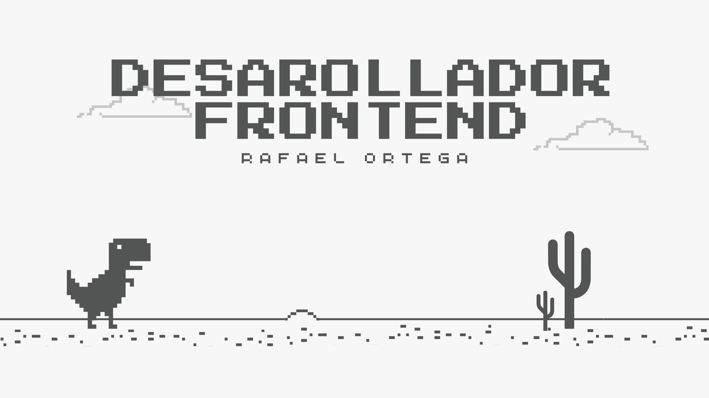

# 👋 ¡Hola! Soy Rafael Ortega  

💻 **Desarrollador Web Full Stack** orientado al **Front-End**  
🚀 Apasionado por crear experiencias web y mobile modernas, fluidas y funcionales  

  

### 🧠 Sobre mí  
Soy un desarrollador especializado en **React**, framework en el cual tengo un **certificado de especialización**.  
También tengo conocimientos en **Angular**, aunque mi enfoque principal está en el ecosistema de **React**.  

Mi **mano derecha es JavaScript**, lenguaje con el que me especialicé junto a **TypeScript**.  
Trabajo con librerías y frameworks como **Bootstrap**, **Bulma** y **TailwindCSS**,  
aunque prefiero **crear componentes manualmente** para tener mayor control sobre el diseño y el código.  

🧩 Poseo un **nivel básico de inglés**, suficiente para comprender documentación técnica y comunicarme en entornos de desarrollo.  

---

### 💼 Emprendimiento actual  
Actualmente estoy formando una **mini empresa de desarrollo web y mobile**,  
donde trabajamos en diversos proyectos —entre ellos, una **app para gimnasios** 🏋️‍♂️  

---

### ⚙️ Tecnologías y herramientas  

#### 💻 Front-End  

#### ⚙️ Back-End y otros  

---

### 📊 Estadísticas de GitHub  

  

---

### 📫 Contacto  
📞 **Teléfono:** +54 2625 419121  
📧 **Correo:** [rafa111x_ortega@hotmail.com](mailto:rafa111x_ortega@hotmail.com)  

---

⭐ *Siempre en busca de nuevos desafíos y oportunidades para seguir aprendiendo y creciendo como desarrollador.*
